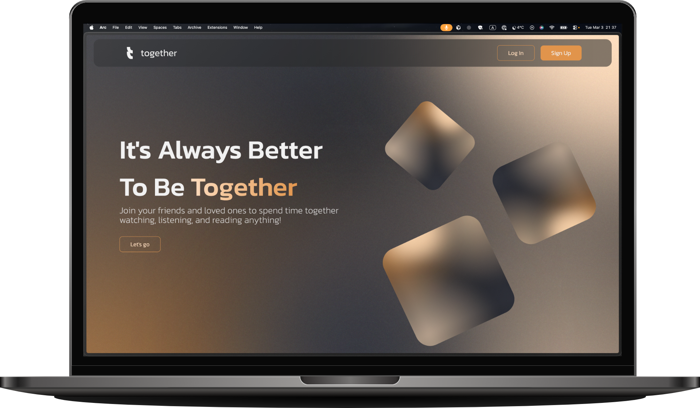
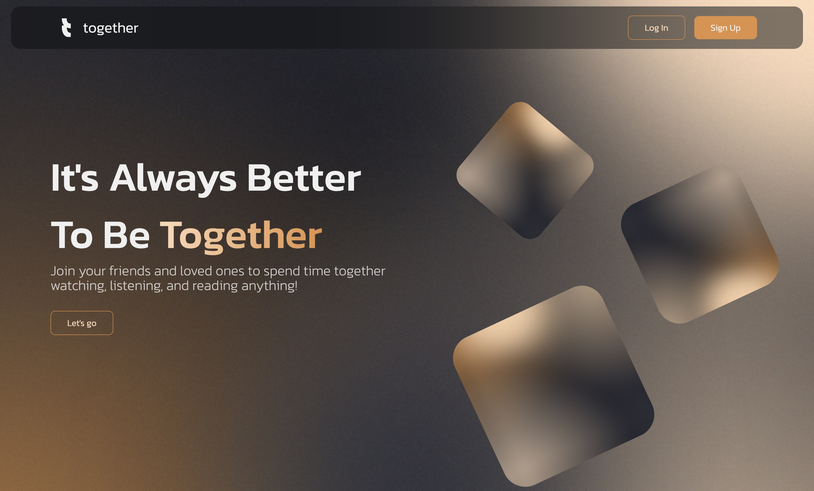
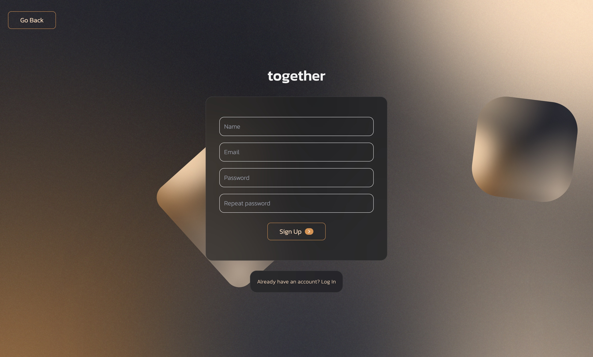
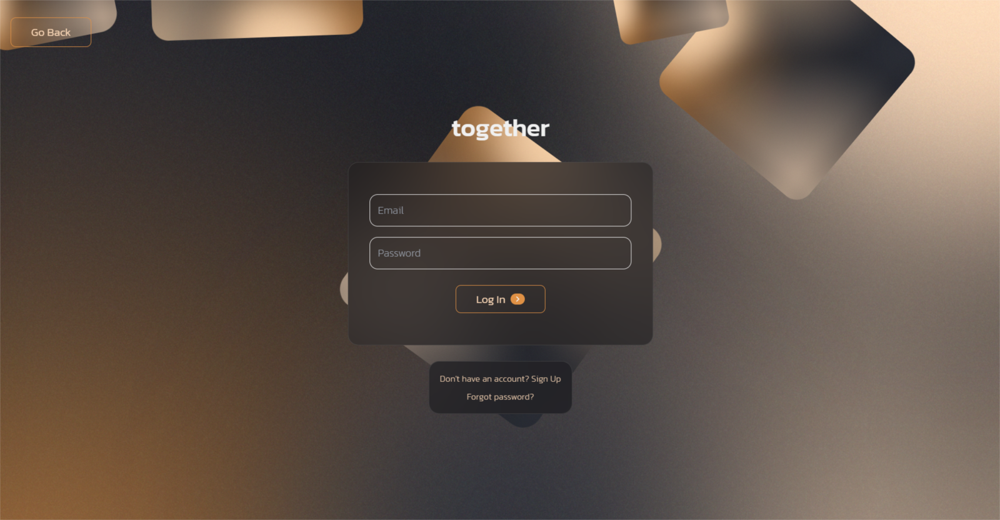
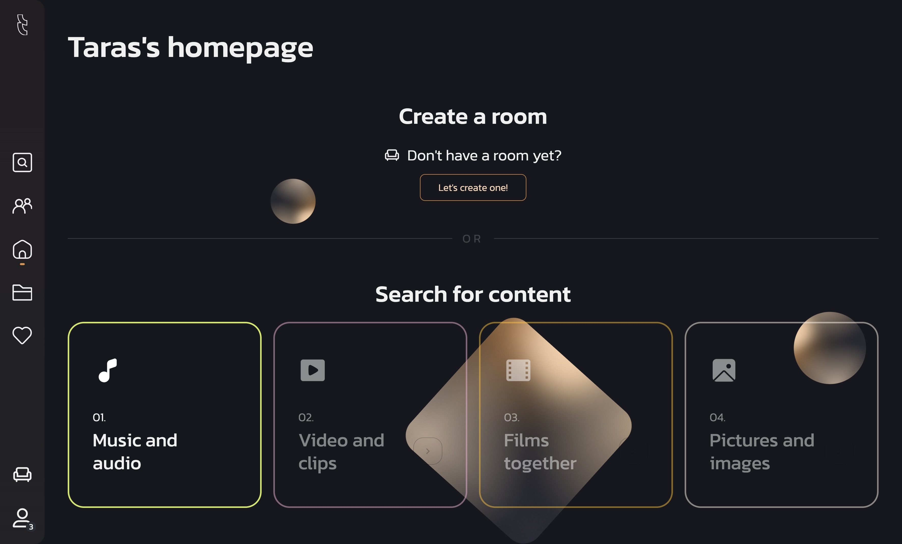
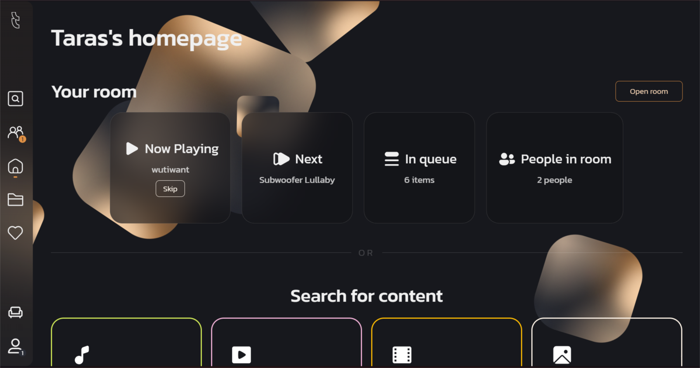
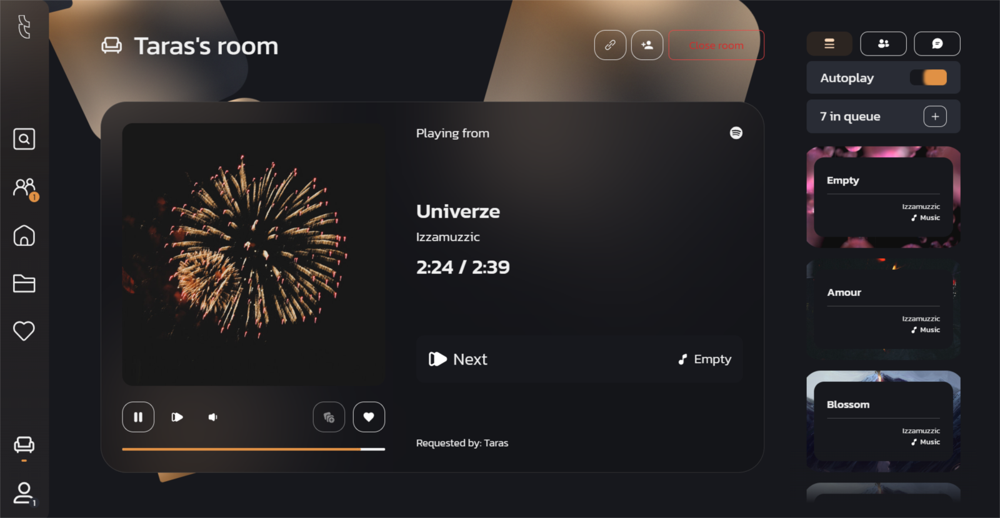
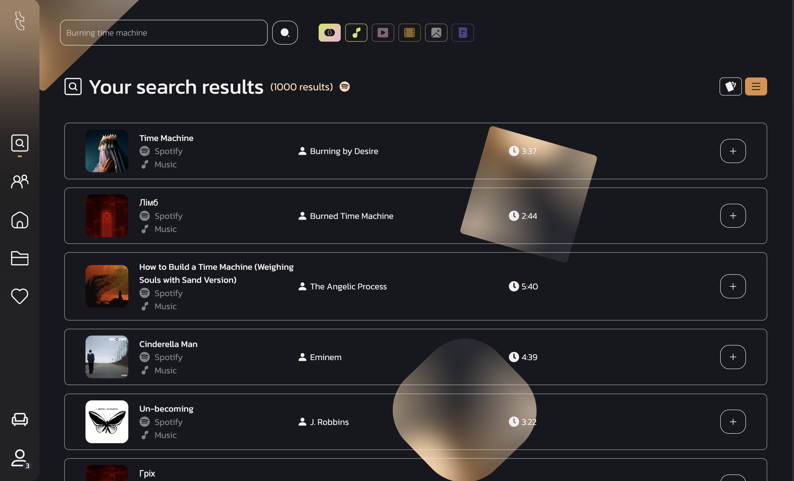
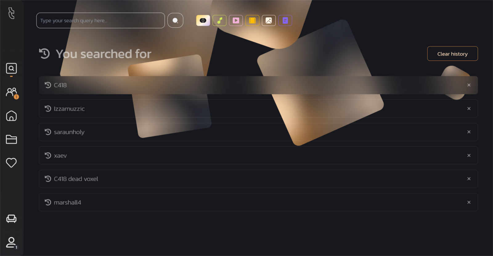
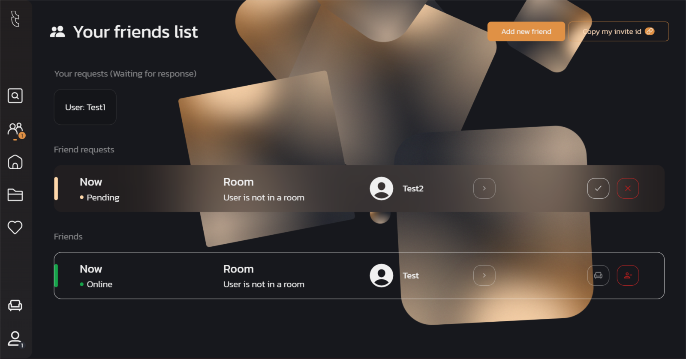

<div align="center">
</img>
</div>
<h1 align="center">Together – Collaborative Listening Web App</h1>

<p align="center">Together is an experimental React + Vite web application made in a rush as a challenge for **listening to music together in real time**.  
It integrates with the <b>Spotify Web API</b> and a <b>custom backend</b> (websockets, Firebase) to provide shared rooms, synchronized playback, and a social layer around music.</p>



<div align="center">


</div>

> [!CAUTION]
>
> ### ⚠️ This project is archived
>
> **The initial reason** for this project was to see what I could do in a short period of time.
>
> Since my time limit has expired, I don't want to continue supporting this project, so it's permanently frozen.

---

### Table of Contents

- [**Overview**](#overview)
- [**Features**](#features)
- [**Screenshots**](#screenshots)
- [**Architecture**](#architecture)
- [**Getting Started**](#getting-started)
- [**Environment & Configuration**](#environment--configuration)
- [**Available Scripts**](#available-scripts)
- [**Roadmap**](#roadmap)
- [**License**](#license)

---

## Overview

Together lets you:

- **Create or join rooms** with friends
- **Control a shared Spotify player** (play / pause / skip for everyone)
- **Chat and queue tracks** collaboratively
- **Browse music, search, and manage your library**
- **See who is online** and manage a friends list

The goal of the project is to explore **real-time collaboration**, **Spotify integration**, and a **component‑driven UI** using modern React tooling.

---

## Features

- **Authentication**
  - Email/password + third‑party login (via Firebase)
  - Protected routes and private layout
- **Shared Music Player**
  - Built on `react-spotify-web-playback-sdk`
  - Shows current track, playback progress, next track
  - Room‑based control: host or allowed members can control playback
- **Spotify Integration**
  - Uses `@spotify/web-api-ts-sdk`
  - Search tracks, albums, artists, playlists
  - Browse and manage liked/library content
- **Rooms (Lobbies)**
  - Create/join rooms
  - Queue tracks to the room playlist
  - Real‑time updates over websockets
- **Chat & Presence**
  - Room sidebar with chat view
  - Shows participants and queue info
- **Search**
  - Global search across Spotify content
  - History section and filters
- **Library & Collections**
  - Liked tracks and saved content views
  - Collections page for saved / custom groupings
- **Friends**
  - Friends list with online/offline state
  - Invite friends into rooms
- **Responsive, modern UI**
  - Tailwind‑style utilities + custom styles
  - Framer Motion transitions
  - Route animations and loaders

---

## Screenshots


- **Demo**

<div align="center">
  
</div>

- **Landing / Auth**

<div align="center">
  
  
  
</div>

- **Home & Player**

<div align="center">
  
  
</div>

- **Room & Queue**

<div align="center">
  
</div>

- **Search & Results**

<div align="center">
  
  
</div>

- **Friends & Invites**

<div align="center">
  
</div>

---

## Architecture

At a high level:

- **Entry point**: `main.tsx` wires React, Redux, router, and global providers.
- **App shell**: `App.tsx` sets up:
  - `PlaybackSDKWrapper` for Spotify playback
  - `Configurator` for app configuration, token refresh, and websocket bootstrap
  - Global notifications
  - `AppRouter` for routes
- **Routing**: `router/router.tsx` defines public and private routes, with:
  - `PrivateLayout` for authenticated areas
  - Pages such as `Home`, `Search`, `Friends`, `Liked`, `Collections`, `Settings`, `Error`
- **State management**:
  - `authSlice`, `userSlice`, `roomSlice`, `notificationSlice`, etc.
  - Strongly typed hooks like `useAppDispatch`, `useAppSelector`
- **Real‑time & config**:
  - `Configurator` initializes app config from `localStorage`
  - Sets up web socket listeners (`useWebSocketUpdates`)
  - Manages Spotify token refresh lifecycle
- **UI composition**:
  - Reusable components such as `AppNavbar`, `PageWrapper`, `InfoCard`, `MessageCard`, `FriendItem`, `ContentCard` etc.
  - Containers for higher‑level behavior (e.g., `RoomSidebar`, `MusicPlayer`, `HomeInfo`, modals)

---

## Getting Started

### Prerequisites

- **Node.js** \(recommended: `>=18`\)
- **npm** \(or another Node package manager\)
- A **Spotify Developer Application** (for client ID / redirect URI, if you want full playback)
- A configured **Firebase project** (for auth and backend features)

### Installation

```bash
# Clone the repository
git clone <your-fork-or-origin-url> together-webapp
cd together-webapp

# Install dependencies
npm install
```

### Running in development

```bash
npm run dev
```

This starts Vite’s dev server.  
By default the app runs at `http://localhost:5173`

### Production build

```bash
npm run build
npm run preview
```

---

## Environment & Configuration

The app expects a number of environment variables (exact names may vary depending on your backend wiring). Typical settings include:

- **Spotify**
    - `VITE_SPOTIFY_CLIENT_ID`
    - `VITE_SPOTIFY_REDIRECT_URI`
    - `VITE_SPOTIFY_SCOPES`
- **Firebase**
    - `VITE_FIREBASE_API_KEY`
    - `VITE_FIREBASE_AUTH_DOMAIN`
    - `VITE_FIREBASE_PROJECT_ID`
    - `VITE_FIREBASE_STORAGE_BUCKET`
    - `VITE_FIREBASE_MESSAGING_SENDER_ID`
    - `VITE_FIREBASE_APP_ID`

Create a `.env` file in the project root and fill in the required variables, for example:

```bash
VITE_SPOTIFY_CLIENT_ID=your_client_id
VITE_SPOTIFY_REDIRECT_URI=https://localhost:5173/service-redirect
VITE_WS_URL=wss://your-websocket-server
VITE_API_BASE_URL=https://your-api-server
# Firebase keys...
```

> Check the `.env.example` to align your environment variables with the actual configuration.

---

## Available Scripts

From `package.json`:

- **`npm run dev`**: Start the Vite dev server.
- **`npm run build`**: Type‑check and build for production.
- **`npm run type-check`**: Run TypeScript type checking.
- **`npm run lint`**: Run ESLint across `.ts` and `.tsx` files.
- **`npm run scan`**: Run type checking and linting together.
- **`npm run preview`**: Preview the production build locally.

---

## Roadmap

Planned / potential improvements:

- **Refine architecture and abstractions** to simplify maintenance
- **Improve error handling and service health UI**
- **Enhance room permissions and moderation tools**
- **Add more granular playback controls and visualizations**
- **Better mobile UX** with optimized navigation and layouts
- **Extended social features** (profiles, activity feed, recommendation sharing)
- **Support for watching videos/photos together**
- **Support for reading books/texts together**

---

## License

This project is currently **closed source / private** for personal or internal use.  
If you intend to use parts of it publicly, please add an explicit license and update this section accordingly.
